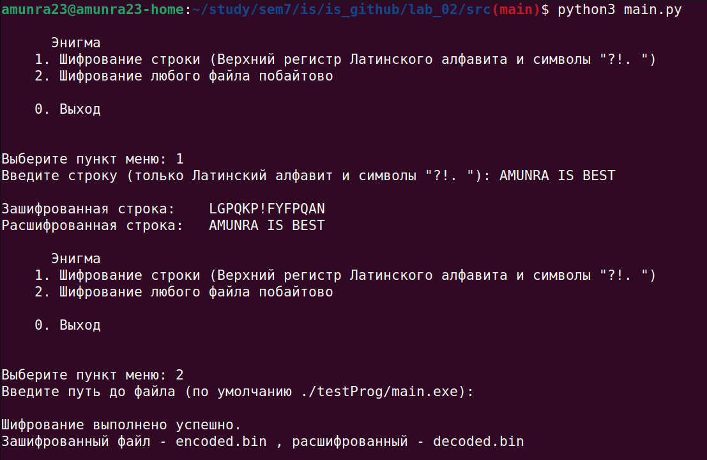

# Защита Информации

 [Я в Телеграм](https://t.me/amunra2) 

# Лабораторная работа №2

## Цель

Целью данной работы является создание программы, которая повторяет работу шифровального аппарата "Энигма".

## Детали реализации

...

## Ссылки

[Код](./src)

## Запуск

### Основное приложение

...
<!-- 1. Установить пакеты `python3`

2. Перейти в папку с исходным кодом
   
```bash
cd ./src
```

2. Запустить установщик
   
```bash
python3 install.py
```

3. Запустить программу
   
```bash
python3 answerIs.py
``` -->

## Пример

...
<!--  -->

_@amunra2 (2021г.)_
